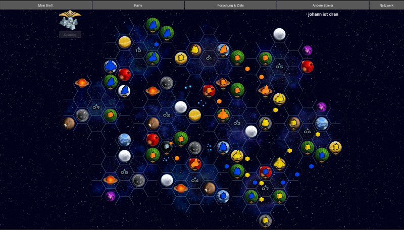
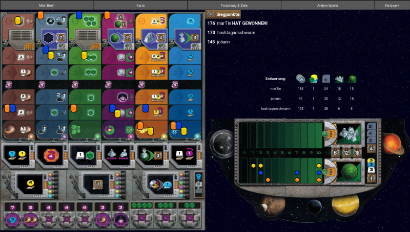

# gaia-online
 

    
  </a>

  <h3 align="center">Gaia Project Online Multiplayer</h3>

  
Table of Contents

  <ol>
    <li><a href="#about-the-project">About the Project</a></li>
    <li><a href="#about-the-game">About the Game</a></li>
    <li><a href="#installation">Installation</a></li>
    <li><a href="#usage">Usage</a>
      <ul>
        <li><a href="#starting-the-game">Starting the Game</a></li>
        <li><a href="#modyfying-the-setup">Modyfying the Setup</a></li>
        <li><a href="#choosing-your-character">Chhoosing your Character</a></li>
        <li><a href="#building-and-upgrading">Building and Upgrading</a></li>
        <li><a href="#research">Research</a></li>
        <li><a href="#free-actions">Free Actions</a></li>
      </ul>
    </li>
    <li><a href="#contact">Contact</a></li>
    <li><a href="#acknowledgments">Acknowledgments</a></li>
  </ol>

## About the Project

This project is for the development of an online multiplayer version of the great boardgame "Gaia Project". It is for private use only as we do not own any rights to use the brand and its products. It is mainly build in Python. For the GUI we used [kivy](https://kivy.org/#home).

## About the Game

Gaia Project is a multiplayer Boardgame by Helge Ostertag and Jens Drögemüller which can be played by up to four players.

Each player takes over one of 14 races and colonizes the planets of a galaxy by building various buildings on them. These are upgraded into different types as the game progresses. This allows access to more resources and actions. Six research areas are available to advance the expansion in the galaxy faster and more efficiently than the other players.

The different races with different abilities, changing game and victory point conditions, and a variable playing field offer countless combinations that make Gaia Project exceedingly changeable and permanently exciting.'/home/johann/anaconda3/bin/python -m pip install --upgrade pip' command.

## Installation

## Usage

### Starting the Game

To connect whith the other players you have to enter the hosts IP-adress in addition to your name.

### Modyfying the Setup

Before each game, a setup is randomly chosen. Each player can modify the setup by requesting a new random setup. In case of the setup of the galaxy (the map on which the game is played), one can arrange the placement of the tiles of the map via drag&drop.

### Choosing your Character

Each player must chose the character/fraction he wants to play by clicking on it's icon. One can hover over their icons to get additional information about them.

### Building and Upgrading

If it's your turn, u can click on any planet and if all conditions are met, a mine will be placed on it. If you click on a planet with a building of yours on it, it will be upgraded. When there is more than one upgrade possible, you will be asked which one you prefer.

    
  </a>

### Research

You can click on any research branch in the research window to level-up in it.

    
  </a>

### Free Actions

During your turn you can execute free actions at any time by clicking on them on your fraction board. 

## Contact

Martin Schönstedt  
Johann Ukrow

(<a href="#top">back to top</a>)

